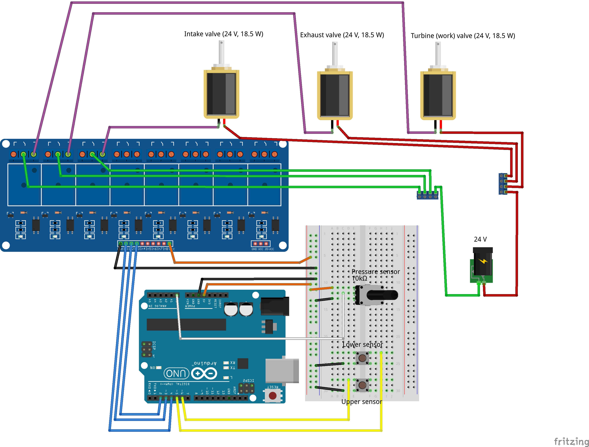

# Compressed Air Energy Saving System

An Arduino-based control system for a multi-barrel compressed air energy storage and recovery system. This project implements intelligent coordination between multiple air compression barrels to achieve continuous energy production while maximizing efficiency.

🤖 **Development Notice**: This project is being developed rapidly using GitHub Copilot AI assistance. The code and comprehensive test suite are primarily written by GitHub Copilot (Claude Sonnet 4) through iterative prompting. While extensively tested and validated through both rigorous software testing and real Arduino hardware verification, information in this README might not always be fully accurate or up-to-date.

## 🎯 Overview

This system is based on [Czech Patent CZ 310138](https://isdv.upv.gov.cz/doc/FullFiles/Patents/FullDocuments/310/310138.pdf) and implements a sophisticated state machine for coordinating multiple compressed air barrels to:

- **Continuous Energy Production**: Ensure uninterrupted power generation through intelligent barrel coordination
- **Safety-First Design**: Configurable AUTO_START prevents accidental pressurization on startup
- **Efficiency Optimization**: Minimize energy waste during barrel transitions
- **Performance Monitoring**: Real-time timing analysis and predictive optimization
- **Scalable Architecture**: Support for 1-4 barrels with configurable coordination logic
- **System Robustness**: Automatic startup assessment and recovery from unexpected resets

## 🏗️ System Architecture

### Multi-Barrel State Machine

Each barrel operates through an 8-state system with hardware-accurate valve coordination.

**Example sequence:** IDLE → INIT → INTAKE → WAIT_FOR_WORK → WORK → EXHAUST → INTAKE → WORK → EXHAUST → (continues cycling...)

**Emergency state:** EXIT (manual shutdown, leads back to IDLE)

**State Descriptions:**
- **IDLE**: Safe startup state - all valves closed, no automatic progression
- **INIT**: Initial air space preparation - opens INTAKE+WORK valves simultaneously for hardware coordination
- **WAIT_FOR_INTAKE**: Waiting for opportunity to start preparation
- **INTAKE**: Pressurizing the barrel with compressed air (time-limited to configurable duration)
- **WAIT_FOR_WORK**: Ready to work, waiting for current working barrel to finish
- **WORK**: Generating energy by releasing air through turbine
- **EXHAUST**: Releasing remaining pressure and refilling with water
- **EXIT**: Final coordination - opens WORK+EXHAUST valves simultaneously for complete pressure release (emergency/manual use)

### Coordination Logic

The system ensures continuous energy production by:
1. **Hardware-Accurate Valve Coordination**: INIT state coordinates INTAKE+WORK valves, EXIT state coordinates WORK+EXHAUST valves
2. **Time-Limited INTAKE**: Configurable INTAKE duration prevents excessive pressure buildup (default 2 seconds, configurable 100-10000ms)
3. **Overlapping Preparation**: Next barrel starts INTAKE while current barrel is in WORK
4. **Immediate Handoff**: Zero-gap transitions between working barrels
5. **Smart Scheduling**: Prevents resource conflicts during preparation phases
6. **Adaptive Timing**: Uses historical data to optimize preparation timing
7. **2-Barrel Optimization**: Direct EXHAUST→INTAKE transitions eliminate energy gaps
8. **Robust Startup**: Automatic assessment and recovery from unexpected system resets

#### Optimized 2-Barrel Operation
For systems with exactly 2 barrels, the coordination logic has been optimized to eliminate unnecessary WAIT_FOR_INTAKE states:

- **Direct Transitions**: Barrels go directly from EXHAUST to INTAKE
- **Continuous Production**: Always maintains exactly one barrel working
- **Zero Waiting**: WAIT_FOR_INTAKE state bypassed entirely during normal operation
- **Energy Gap Elimination**: Zero downtime between barrel handoffs

This optimization ensures that 2-barrel systems achieve perfect continuous energy production without the coordination overhead needed for 3+ barrel systems.

## 🛡️ System Robustness & Recovery

### Startup Assessment System

The system includes comprehensive startup assessment capabilities to handle unexpected Arduino resets or power interruptions gracefully. When the system starts, it automatically:

1. **Sensor-Based State Assessment**: Analyzes pressure and water level sensors to determine the actual physical state of each barrel
2. **Safe State Recovery**: Transitions barrels to appropriate operational states based on sensor readings
3. **Conservative Safety**: Prioritizes safety over efficiency during recovery (e.g., WORK → WAIT_FOR_WORK transitions)
4. **Valve Safety Protocol**: Ensures all valves are closed initially before making any state transitions

### Recovery Decision Matrix

The startup assessment uses sensor readings to intelligently determine barrel states:

| Pressure | Water Level | Assessed State | Recovery Action |
|----------|-------------|----------------|-----------------|
| High | Above Lower | WAIT_FOR_WORK | All valves closed, ready for coordination |
| High | Below Lower | EXHAUST | Open exhaust valve, complete pressure release |
| Low | At Upper | INTAKE | Continue intake process |
| Low | Below Lower | WAIT_FOR_INTAKE | All valves closed, ready for next cycle |
| Low | Mid-Level | INTAKE | Continue intake process |

### Safety Features

#### Startup Protocol
```cpp
assess_startup_state();  // Called automatically in setup()
```

- **Valve Reset**: All valves closed initially for safety
- **Sensor Stabilization**: Brief delays allow sensors to provide accurate readings
- **Conservative Assessment**: When in doubt, chooses safer operational states
- **Detailed Logging**: Complete assessment results logged for debugging

#### Recovery Scenarios
The system handles various reset scenarios:

- **Reset During INTAKE**: Continues intake process based on current pressure/water levels
- **Reset During WORK**: Transitions to WAIT_FOR_WORK for safe turbine coordination
- **Reset During EXHAUST**: Continues exhaust process to complete pressure release
- **Reset Between States**: Places barrels in appropriate waiting states for coordination

#### Platform Compatibility
The startup assessment system is designed to work across different Arduino platforms:

- **Arduino Uno R3**: Memory-optimized with reduced timing history (3 entries)
- **Arduino Uno R4 WiFi**: Full feature set with extended timing history (10 entries)
- **Conditional Compilation**: Automatically adapts to available memory constraints

### Example Startup Assessment Log
```
=== STARTUP ASSESSMENT ===
System reset detected - assessing barrel states from sensors...
Barrel0 sensors: P=385 (HIGH) U=NO_WATER L=WATER
Barrel0 assessed as: WAIT_FOR_WORK
Barrel0 recovery: All valves closed, waiting
Barrel1 sensors: P=145 (LOW) U=WATER L=WATER
Barrel1 assessed as: INTAKE
Barrel1 recovery: Intake valve opened
Startup assessment complete: Barrel0:WAIT_FOR_WORK | Barrel1:INTAKE
=== STARTUP ASSESSMENT COMPLETE ===
```

## 🔧 Hardware Components



### Platform Support

- **Arduino R4 WiFi**: Full feature set with WiFi connectivity and Android app integration (32KB RAM)
- **Arduino Uno R3**: Core functionality with memory optimizations (2KB RAM)
- **Arduino Mega 2560**: Enhanced capacity for larger installations (8KB RAM)

*Memory optimizations and verbose logging automatically applied based on target platform.*

### Per Barrel (up to 4 barrels supported):
- **3 Solenoid Valves** (controlled via Songle SRD-5VDC-SL-C relay module):
  - Intake valve (air compression)
  - Exhaust valve (pressure release)
  - Turbine valve (energy generation)
- **2 Water Level Sensors**:
  - Lower level sensor (work completion detection)
  - Upper level sensor (exhaust completion detection)
- **1 Pressure Sensor**: Monitors compression level

**Note**: The system uses low-triggered relay modules (active LOW) - valves open when Arduino pin is LOW, close when HIGH.

### Arduino Connections

| Component | Barrel 0 | Barrel 1 | Barrel 2 | Barrel 3 |
|-----------|----------|----------|----------|----------|
| Intake Valve | Pin 2 | Pin 7 | Pin 12 | Pin 22 |
| Exhaust Valve | Pin 3 | Pin 8 | Pin 13 | Pin 23 |
| Turbine Valve | Pin 4 | Pin 9 | Pin 14 | Pin 24 |
| Lower Sensor | Pin 5 | Pin 10 | Pin 15 | Pin 25 |
| Upper Sensor | Pin 6 | Pin 11 | Pin 16 | Pin 26 |
| Pressure Sensor | A0 | A1 | A2 | A3 |

## 📊 Performance Monitoring

### Real-Time Timing Analysis
The system continuously monitors and records:
- **State Durations**: Time spent in each operational state
- **Wait Times**: Efficiency metrics for coordination delays
- **Cycle Predictions**: Optimal timing for barrel preparation
- **Performance Trends**: Historical analysis for system optimization

### WiFi Logging (Arduino Uno R4 WiFi)
For remote monitoring, the system supports WiFi-based UDP logging:

**Setup:**
1. Create `wifi_credentials.h` file with your network details:
   ```cpp
   #ifndef WIFI_CREDENTIALS_H
   #define WIFI_CREDENTIALS_H
   const char* WIFI_SSID = "YourWiFiName";
   const char* WIFI_PASSWORD = "YourPassword";
   #endif
   ```

2. The system broadcasts log messages to `255.255.255.255:1768` (UDP)

**Monitoring Options:**
- **Android**: [UDP Terminal](https://play.google.com/store/apps/details?id=com.hardcodedjoy.udpterminal) - Listen on port 1768
- **Computer**: `nc -u -l 1768` (netcat command)
- **Phone Hotspot**: Works perfectly with Android hotspot networks

**Benefits:**
- Real-time monitoring without serial cable connection
- Remote system diagnostics and performance analysis
- Continuous logging during field operations
- Multiple devices can receive the same log stream simultaneously

### Serial Output Example
```
Compressed Air Energy System Started
Barrel0:INTAKE (P:145 U:0 L:0) | Barrel1:INTAKE (P:135 U:0 L:0)
Barrel0:INTAKE (P:205 U:0 L:0) | Barrel1:INTAKE (P:195 U:0 L:0)
Barrel0:INTAKE (P:265 U:0 L:0) | Barrel1:INTAKE (P:255 U:0 L:0)
Barrel0:INTAKE (P:325 U:0 L:0) | Barrel1:INTAKE (P:315 U:0 L:0)
Barrel0:WORK (P:385 U:0 L:0) | Barrel1:INTAKE (P:375 U:0 L:0)
Barrel0:WORK (P:345 U:0 L:0) | Barrel1:WAIT_FOR_WORK (P:375 U:0 L:0)
Barrel0:WORK (P:305 U:0 L:0) | Barrel1:WAIT_FOR_WORK (P:375 U:0 L:0)
Barrel0:WORK (P:265 U:0 L:1) | Barrel1:WAIT_FOR_WORK (P:375 U:0 L:0)
Barrel0:EXHAUST (P:205 U:1 L:1) | Barrel1:WORK (P:335 U:0 L:0)
Barrel0:EXHAUST (P:145 U:1 L:1) | Barrel1:WORK (P:295 U:0 L:0)
Barrel0:INTAKE (P:125 U:0 L:0) | Barrel1:WORK (P:255 U:0 L:1)
Barrel0:INTAKE (P:185 U:0 L:0) | Barrel1:WORK (P:215 U:0 L:1)
Barrel0:WAIT_FOR_WORK (P:385 U:0 L:0) | Barrel1:WORK (P:175 U:0 L:1)
Barrel0:WORK (P:385 U:0 L:0) | Barrel1:EXHAUST (P:135 U:1 L:1)
Barrel0:WORK (P:345 U:0 L:0) | Barrel1:INTAKE (P:95 U:0 L:0)

=== TIMING SUMMARY ===
Barrel 0 averages: INTAKE=5100ms WORK=5000ms EXHAUST=2000ms
Barrel 1 averages: INTAKE=7100ms WORK=6000ms EXHAUST=2500ms

=== TIMING PREDICTIONS ===
Barrel0 cycle: 12100ms, start INTAKE 7000ms early
Barrel1 cycle: 14600ms, start INTAKE 8000ms early
```

**Key Optimization**: Notice how in the optimized 2-barrel system, Barrel0 goes directly from EXHAUST to INTAKE (line 11) and Barrel1 does the same (line 15), eliminating WAIT_FOR_INTAKE states that could cause energy gaps.

## 🛡️ Safety Features

### AUTO_START Safety Mode
For enhanced safety, the system includes a configurable auto-start feature:

**Default Safe Mode (AUTO_START=0)**:
- Barrels start in **IDLE state** - all valves closed, no automatic pressurization
- System waits for external control (Android app or manual command)
- Prevents accidental barrel activation on power-up
- **Startup assessment skipped** for safety - no automatic state detection
- Serial output: *"AUTO_START disabled: Waiting for external control"*

**Auto-Start Mode (AUTO_START=1)**:
- **Startup assessment performed** - barrels recover to appropriate operational states
- Immediate transition from IDLE to normal operation cycle
- Serial output: *"AUTO_START enabled: System will begin operations automatically"*

**Configuration**: Edit `constants.h` and change `#define AUTO_START 0` to `#define AUTO_START 1` for automatic startup.

**Android App Integration**: When AUTO_START=0, the system requires "MODE AUTO" command from the Android app to activate IDLE barrels and begin operation. **The startup assessment runs when switching to AUTO mode** to handle any messy states from manual control and automatically sets barrels to appropriate operational states.

## 🎛️ Advanced Command System

The system supports comprehensive control via Serial (9600 baud) and WiFi UDP (port 1768):

### Mode Control
```
MODE AUTO    # Switch to automatic operation with startup assessment
MODE MANUAL  # Enable manual control mode (preserves current states)
```

### Direct Barrel Control
```
CMD <STATE> <BARREL>    # Set specific barrel to specific state (auto-switches to manual)
```

**Examples:**
```
CMD INIT 0         # Initialize air space in Barrel 0 (INTAKE+WORK coordination)
CMD INTAKE 0       # Force Barrel 0 to time-limited INTAKE state
CMD WORK 1         # Force Barrel 1 to WORK state
CMD EXHAUST 0      # Force Barrel 0 to EXHAUST state
CMD EXIT 1         # Force coordinated exit in Barrel 1 (WORK+EXHAUST coordination)
```

**Supported States:**
- `IDLE` - Safe state, all valves closed
- `INIT` - Air space preparation with valve coordination
- `INTAKE` - Pressurize barrel (time-limited)
- `WORK` - Generate energy through turbine
- `EXHAUST` - Release pressure and refill with water
- `EXIT` - Coordinated pressure release
- `WAIT_FOR_INTAKE`, `WAIT_FOR_WORK` - Coordination states

### Individual Valve Control
```
VALVE <BARREL> <VALVE> <OPEN|CLOSE>    # Control individual valves directly
```

**Examples:**
```
VALVE 0 INTAKE OPEN      # Open Barrel 0 intake valve
VALVE 1 WORK CLOSE       # Close Barrel 1 work/turbine valve
VALVE 0 EXHAUST OPEN     # Open Barrel 0 exhaust valve
```

**Available Valves:**
- `INTAKE` - Compressed air intake valve
- `WORK` - Turbine/work valve for energy generation
- `EXHAUST` - Pressure release and water refill valve

### System Configuration
```
SET <PARAMETER> <VALUE>    # Configure system parameters at runtime
```

**Examples:**
```
SET INTAKE_DURATION 3000    # Set INTAKE time limit to 3 seconds (100-10000ms range)
SET NUM_BARRELS 3           # Configure system for 3 barrels (1-4 range)
```

**Configurable Parameters:**
- `INTAKE_DURATION` - Time limit for INTAKE state (100-10000 milliseconds)
- `NUM_BARRELS` - Number of active barrels in the system (1-4 barrels)

### System Status and Help
```
STATUS    # Display current mode, barrel states, and configuration
HELP      # Show comprehensive command reference
```

### Command Features

#### Global Control
- **Enhanced Mode Switching**: AUTO mode performs startup assessment, MANUAL mode preserves current states
- **Auto-Switch to Manual**: Using CMD or VALVE commands automatically switches to manual mode
- **Persistent Configuration**: SET commands make runtime changes that persist until restart
- **No Timeouts**: Manual control persists indefinitely (no automatic return to auto mode)
- **Override Protection**: Manual mode completely overrides automatic state machine

#### Safety & Flexibility
- **Real-time Switching**: Can switch between manual and automatic at any time
- **State Preservation**: Manual states persist until explicitly changed
- **Full Valve Control**: VALVE commands provide direct individual valve control
- **Runtime Configuration**: SET commands allow parameter changes without recompilation
- **Monitoring Continues**: Sensor readings and logging continue in all modes

### Example Enhanced Session
```bash
# Connect via serial or UDP
> STATUS
Number of barrels: 2
INTAKE duration limit: 2000 ms
Mode: AUTO
Barrel0: WORK (auto)  Barrel1: EXHAUST (auto)

> SET INTAKE_DURATION 3000
INTAKE duration set to 3000 ms

> VALVE 0 WORK CLOSE
Auto-switching to MANUAL mode for direct barrel control
Barrel 0 WORK valve closed

> CMD INIT 1
Manual command: Barrel1 set to INIT

> STATUS
Number of barrels: 2
INTAKE duration limit: 3000 ms
Mode: MANUAL
Barrel0: WORK (manual)  Barrel1: INIT (manual)

> MODE AUTO
System set to AUTO mode - automatic logic enabled
Assessing barrel states for safe automatic operation...
```

### WiFi Command Interface
For remote operation, send commands via UDP to port 1768:

**Using netcat (Linux/Mac):**
```bash
echo "SET NUM_BARRELS 3" | nc -u -w1 192.168.1.100 1768
echo "VALVE 0 INTAKE OPEN" | nc -u -w1 192.168.1.100 1768
echo "CMD INIT 1" | nc -u -w1 192.168.1.100 1768
echo "STATUS" | nc -u -w1 192.168.1.100 1768
```

**Using UDP Terminal (Android):**
1. Set target IP to Arduino's WiFi IP
2. Set port to 1768
3. Type commands (SET, VALVE, CMD, STATUS) and press send

### Use Cases
- **System Testing**: Manually cycle through all 8 barrel states for validation
- **Hardware Testing**: Individual valve control for maintenance and diagnostics
- **Runtime Configuration**: Adjust INTAKE duration and barrel count without recompilation
- **Troubleshooting**: Force specific states and valve positions to diagnose issues
- **Custom Operations**: Non-standard barrel coordination patterns with INIT/EXIT states
- **Emergency Control**: Override automatic logic in fault conditions

## 🚀 Getting Started

### Prerequisites
- Arduino IDE or compatible development environment
- Arduino Uno/Nano or compatible board
- Hardware components as listed above

### Installation
1. Clone this repository
2. Open `compressed_air_energy_saving.ino` in Arduino IDE
3. Configure `NUM_BARRELS` in the code for your setup (1-4)
4. Upload to your Arduino board

### Configuration
Edit `constants.h` to match your hardware setup:
```cpp
// Safety: AUTO_START controls automatic barrel activation on startup
#ifndef AUTO_START
#define AUTO_START 0      // 0=IDLE mode (safe), 1=auto start with INIT states
#endif

// Number of barrels in your system (can also be changed at runtime)
int NUM_BARRELS = 2;      // Change to 1, 2, 3, or 4

// Timing configuration (can also be changed at runtime)
unsigned long INTAKE_DURATION_MS = 2000;  // INTAKE time limit in milliseconds

// Adjust pressure threshold if needed
const int PRESSURE_TARGET = 700;  // Analog reading threshold
```

**Safety Note**: Keep `AUTO_START 0` for safe startup requiring command activation.

**Runtime Configuration**: Use SET commands to change NUM_BARRELS and INTAKE_DURATION_MS without recompilation.

## 🧪 Testing

### Automated Testing
Run the comprehensive test suite:
```bash
make test
```

This now runs comprehensive testing including:
- **Logic Tests**: C++ unit tests for barrel coordination and state machine
- **Arduino R3 Compatibility**: Compilation test for Arduino Uno with reduced features
- **Arduino R4 WiFi Compatibility**: Full system compilation test for R4 WiFi

Individual test components can be run separately:
```bash
make test-logic          # Run only logic/unit tests
make test-arduino-r3     # Test Arduino R3 compatibility
make test-arduino-r4     # Test Arduino R4 WiFi compatibility
make setup               # Install Arduino CLI and setup environment
```

### Test Coverage
- **8-State Machine Testing**: Complete validation of all states (IDLE, INIT, INTAKE, WORK, EXHAUST, EXIT, WAIT_FOR_INTAKE, WAIT_FOR_WORK)
- Single barrel operation cycle with time-limited INTAKE
- Multi-barrel coordination logic with hardware-accurate valve control
- **Individual Valve Control**: Testing of VALVE commands for direct hardware control
- **Runtime Configuration**: Validation of SET commands for parameter changes
- **Enhanced Command System**: Testing of all CMD states including INIT and EXIT
- Continuous energy production verification with zero energy gaps
- **2-barrel optimization validation**: Zero energy gaps testing with INIT/EXIT coordination
- **WAIT_FOR_INTAKE efficiency**: Minimization of unnecessary wait states
- **Startup assessment testing**: Sensor-based state recovery validation
- **Recovery scenario testing**: Various reset conditions and appropriate responses
- **Time-Limited INTAKE**: Configurable duration testing (100-10000ms range)
- Timing system validation with predictive optimization
- State transition correctness for all 8 states
- Memory optimization for constrained platforms
- Arduino R3/R4 WiFi compatibility

### CI/CD Integration
Automated testing via GitHub Actions:
- Validates logic correctness
- Confirms Arduino compilation compatibility (both Uno R3 and R4 WiFi)
- Memory optimization validation for different Arduino platforms
- Ensures code quality and reliability

## 📁 Project Structure

```
compressed_air_energy_saving/
├── compressed_air_energy_saving.ino  # Main Arduino sketch
├── logic.cpp                         # Core state machine logic
├── logic.h                           # Logic interface and definitions
├── constants.h                       # Hardware pin mappings and constants
├── commands.cpp                      # Command processing (Serial/WiFi)
├── commands.h                        # Command interface
├── wifi.cpp                          # WiFi connectivity (R4 WiFi only)
├── wifi.h                            # WiFi interface
├── test_logic.cc                     # Comprehensive test suite
├── Makefile                          # Build and test automation
├── schema.fzz/.jpg                   # Fritzing circuit diagrams
└── README.md                         # This file
```

## 🔬 Technical Details

### State Machine Implementation
- **8-State Architecture**: Complete implementation with IDLE, INIT, INTAKE, WORK, EXHAUST, EXIT, WAIT_FOR_INTAKE, WAIT_FOR_WORK
- **Hardware-Accurate Valve Coordination**: INIT and EXIT states provide proper valve sequencing based on real hardware analysis
- **Time-Limited Operations**: Configurable INTAKE duration prevents hardware damage (100-10000ms range)
- **Arduino-optimized**: Uses simple arrays instead of complex data structures
- **Memory efficient**: Suitable for Arduino Uno's 2KB SRAM with conditional compilation
- **Timing precision**: Millisecond-accurate state duration tracking
- **Robust coordination**: Prevents conflicts and ensures system stability

### Key Algorithms
- **8-State Coordination**: Hardware-accurate state machine with INIT/EXIT valve coordination
- **Time-Limited INTAKE**: Configurable duration limits prevent excessive pressure (default 2000ms)
- **Barrel Selection**: Intelligent choosing of next barrel to prepare
- **Transition Timing**: Optimal handoff timing based on historical data
- **Resource Management**: Prevents simultaneous access to shared resources
- **Performance Optimization**: Continuous improvement through timing analysis
- **2-Barrel Coordination**: Specialized logic for optimal 2-barrel continuous operation
- **Startup Assessment**: Sensor-based state recovery for robust system restarts
- **Individual Valve Control**: Direct hardware control for maintenance and testing
- **Runtime Configuration**: Dynamic parameter adjustment without recompilation

## 🎛️ Configuration Options

### Single Barrel Mode (`NUM_BARRELS = 1`)
- Complete 8-state cycle: IDLE → INIT → INTAKE → WORK → EXHAUST → EXIT → repeat
- Time-limited INTAKE prevents pressure buildup issues
- Individual valve control for maintenance and testing
- Ideal for testing and basic energy storage

### Two-Barrel Mode (`NUM_BARRELS = 2`) - **Optimized**
- **Continuous energy production** with zero gaps using INIT/EXIT coordination
- **Hardware-accurate transitions**: INIT creates air space, EXIT provides coordinated release
- **Perfect coordination**: Always exactly one barrel working
- **Time-limited INTAKE**: Prevents excessive pressure with configurable duration
- **Zero overhead**: Eliminates waiting states entirely

### Multi-Barrel Mode (`NUM_BARRELS = 3-4`)
- Advanced continuous energy production with 8-state coordination
- Overlapping barrel preparation with smart scheduling and INIT state preparation
- WAIT_FOR_INTAKE coordination prevents resource conflicts
- Time-limited INTAKE with EXIT state coordination for proper pressure management
- Zero-gap energy handoffs with predictive timing

## 📈 Performance Optimization

The system provides real-time insights for optimization:
- **8-State Cycle Analysis**: Complete timing analysis for all states including INIT and EXIT
- **Time-Limited INTAKE Monitoring**: Track configurable INTAKE duration effectiveness
- **Cycle Time Analysis**: Identify bottlenecks in barrel operations
- **Wait Time Monitoring**: Measure coordination efficiency
- **Predictive Timing**: Optimize preparation start times
- **Historical Trends**: Long-term performance analysis
- **2-Barrel Efficiency**: Specialized optimization eliminating energy gaps with INIT/EXIT coordination
- **State Minimization**: Reduced WAIT_FOR_INTAKE usage for improved performance
- **Individual Component Analysis**: Valve-level performance monitoring
- **Runtime Configuration Impact**: Monitor effects of parameter changes

## 🔗 References

- **Patent Basis**: [CZ 310138 - Compressed Air Energy Storage System](https://isdv.upv.gov.cz/doc/FullFiles/Patents/FullDocuments/310/310138.pdf)
- **Circuit Diagrams**: `schema.fzz` (Fritzing format)

## 💻 Development Setup

### Quick Start
```bash
git clone [repository]
cd arduino/compressed_air_energy_saving
make setup    # Install Arduino CLI and dependencies
make test     # Verify everything works
```

### Available Commands
- `make test` - Run all tests (logic + Arduino compatibility)
- `make test-logic` - Run only C++ unit tests
- `make test-arduino` - Test Arduino compilation
- `make clean` - Clean build artifacts
- `make setup` - Install Arduino CLI
- `make help` - Show available targets

## 🤝 Contributing

1. Fork the repository
2. Create a feature branch
3. Run tests: `make test`
4. Ensure Arduino compatibility for both R3 and R4 platforms
5. Submit a pull request

## 📄 License

This project implements concepts from Czech Patent CZ 310138. Please review patent documentation for usage rights and restrictions.

---

**🎯 Project Goal**: Achieve continuous, efficient compressed air energy production through intelligent multi-barrel coordination, hardware-accurate valve control, runtime configurability, and real-time performance optimization using an advanced 8-state machine with individual component control capabilities.
