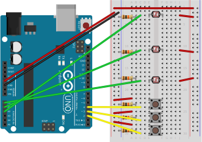

# Photoresistor mouse

- 3 pushbuttons acting as left/middle/right mouse buttons (D2, 3, 4).
- 3 photoresistors acting as x-axis/wheel/y-axis (A0, 1, 2).

During a 5 second setup photoresistors are calibrated (getting real min/max values).

Closer to a photoresistor means one direction, remoter the opposite.
A photoresistor unattended is ignored, so the cursor isn't attracted to one direction,
but still, maneuverability is quite tricky.

Maybe it'd be better to have one photoresistor per one direction,
but that would require also a bigger breadboard to prevent interference.
